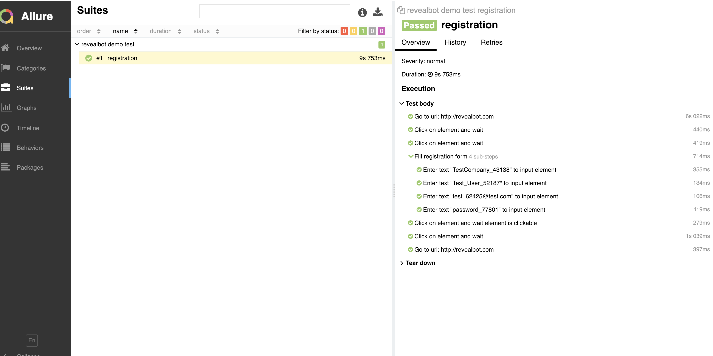

# revealbot demo auto tests

Основа - protractor и jasmine. Язык - TypeScript. Слоистая структура (развитие page object). Добавлены отчеты allure.

## установка

Для работы необходимо установить node.js и java.

Перед первым запуском установить зависимости.
`npm install`

Запустить тест (перед тестом пройдет компиляция в js)
`npm run test`

Создать Allure отчет и сразу открыть в браузере
`npm run report`

## структура

* **helpers/** – директория с описаниями логический страниц (объявлены нужные элементы и действия на страницах).
* **pageMethods/** – директория с описаниями логический страниц (объявлены нужные элементы и действия на страницах). Также есть общие действия.
* **tests/** – директория с тест-сьютами, непосредственно сами тестовые сценарии
* **testsData/** – директория с тестовыми данными
* **utils/** - директория со вспомогательными модулями
* **файлы \*.conf.ts** - конфигурация для запуска, можно настроить под нужный браузер, прикрутить разные репорты и т.д.

## пример отчета

## что улучшить

Для экономии времени сделана только основа. Что не упущено, но пока не доделано:
откомментировать код
добавить allure шаги на каждое действие, в т.ч. на ассерты.
добавить скриншоты при ошибке
